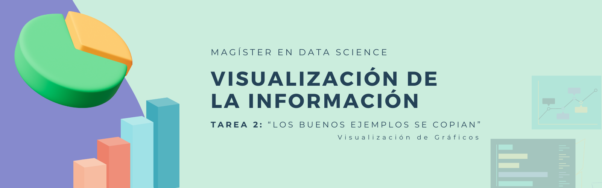

# TAREA 2: LOS BUENOS EJEMPLOS SE COPIAN

   
   
   

En este repositorio se aborda una actividad realizada en la asignatura de Visualización de la Información. La tarea consiste en tratar de reproducir dos visualizaciones del The Economist. Para ello, se debe trata de imitar la paleta de colores que ocuparon, las visualizaciones y las anotaciones que incluyen en los gráficos, además de todos los otros detalles como el título, subtítulo, etcétera.

